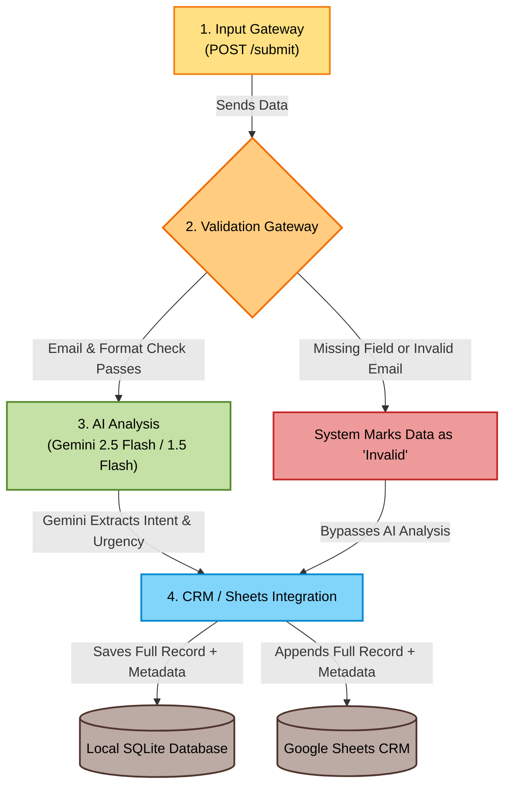

# HW3 – Logic & Intelligent Processing: Academic Architecture Report

This repository contains the complete implementation for **HW3**. It upgrades a basic webhook receiver into an intelligent, validation-aware CRM data pipeline utilizing the Google Gemini AI API, local SQLite relational storage, and real-time Google Sheets synchronization.

---

## 🎯 1. How the Solution Meets the Homework Requirements

This project fully satisfies the HW3 objectives by evolving a basic webhook receiver into a robust, AI-powered CRM data pipeline. It successfully demonstrates conditional logic (**Validation**) and intelligent processing (**AI Integration**).

The solution meets the core requirements by:
1. **Resource Preservation:** Catching and flagging malformed or missing data before it consumes expensive AI API resources.
2. **Intelligent Automation:** Automatically analyzing unstructured customer messages using the Google Gemini 1.5 Flash model.
3. **Structured Storage:** Formatting the final dataset into a highly structured record containing both the original input and system/AI-generated metadata (status, intent, urgency), which is then successfully synchronized to both local (SQLite) and external (Google Sheets) CRM databases.

---

## 🎯 2. Required Architecture and Workflow Structure

The system is explicitly engineered to follow the required strict pipeline: **Input → Validation → AI Analysis → CRM/Sheets**.

*Note: You can double-click the `hw3_diagram.html` file in your folder to view this flowchart in full color in your web browser!*



### Component Breakdown
*   **Input (`{name, email, message}`):** The Node.js server (`hw3_server.js`) exposes a `POST /submit` endpoint. It receives raw JSON payloads representing a customer inquiry.
*   **Validation (Email/Format Check):** A synchronous validation gateway (`validatePayload`) inspects the input. It guarantees the workflow branches correctly: malformed data skips AI processing, while clean data proceeds forward.
*   **AI Analysis (Intent/Urgency):** Validated data is securely transmitted to the Gemini API. The AI acts as an intelligent classifier, extracting business value from the raw text.
*   **CRM/Sheets (Full Record + Metadata):** The data is merged. The final payload containing `{name, email, message, status, intent, urgency, validation_errors}` is successfully appended to both the local SQLite database (`database_hw3.sqlite`) and the Google Sheets Web App.

---

## 🎯 3. Validation Rules and Success Criteria

The application ensures high data integrity by implementing a robust, dual-layered validation strategy within the Node.js code.

### Validation Logic
*   **Missing Field Verification:** The code utilizes strict `if (!payload.field)` and `.trim() === ''` checks to ensure no mandatory field (`name`, `email`, `message`) is left blank.
*   **Regex Email Validation:** To ensure routable email formats, the system enforces the Regular Expression `/^[^\s@]+@[^\s@]+\.[^\s@]+$/`.

> [!IMPORTANT]
> **Success Criteria (Marking Bad Data vs. Categorizing Valid Data):**
> * **If the validation fails:** The system immediately explicitly defines the variable `leadStatus = "Invalid"`. This directly fulfills the requirement to **"mark bad data"**. The exact error (e.g., `"Invalid email format."`) is saved into the database and sheets for CRM administrators to review, while the expensive Gemini AI step is safely bypassed.
> * **If the validation succeeds:** The system defines `leadStatus = "Valid"`, triggering the AI to extract and categorize the data into specific fields (e.g., `intent = "Sales"`, `urgency = "High"`).

---

## 🎯 4. AI Prompt Strategy

The system integrates Google's Gemini Flash model. Because the system requires a programmatic response rather than a conversational one, a highly strict **Zero-Shot Prompting Strategy** is utilized.

### The Exact Prompt Used
```text
Analyze the following customer message. 
Determine the 'intent' (e.g., Sales, Support, Inquiry, Feedback) and the 'urgency' (Low, Medium, High).
Return ONLY a valid JSON object with the keys "intent" and "urgency".

Message: "{message}"
```

### Strategic Breakdown of the Prompt
1. **Explicit Role Assignment:** The AI is immediately tasked with an analytical objective (`"Analyze the following customer message"`).
2. **Predefined Categorization Boundaries:** The AI is strictly guided to choose from specific categories (`Sales`, `Support`, `Inquiry`, `Feedback`) and urgency levels (`Low`, `Medium`, `High`). This prevents the AI from generating random or unexpected categories that the CRM cannot interpret.
3. **Enforced JSON Output:** The phrase `"Return ONLY a valid JSON object with the keys 'intent' and 'urgency'"` is the most critical component. Large Language Models natively generate conversational markdown. By restricting its output to pure JSON, the Node.js application can safely utilize `JSON.parse()` to seamlessly extract the metadata without breaking the server logic.
4. **Resilient Parsing:** To ensure absolute safety, the code also programmatically strips any rogue markdown blocks (like ` ```json `) before parsing the JSON.

---

## 🎯 5. Live Demonstration and Testing Strategy

To fulfill the requirement of **"Show at least one test case"** and **"Walk through each step live"**, follow these exact steps during your presentation.

### Step 1: Start the Webhook Server
Open a terminal in VS Code and run:
```bash
node hw3_server.js
```
*(Leave this terminal open. It will print `"🚀 HW3 Sunucusu çalışıyor! Port: 3002"`)*

### Step 2: Live Testing via Postman or curl

#### 🔴 Test Case 1: Invalid Input (Testing the Validation Check & Bypass)
*Demonstrates that the system flags bad data.*
Send a **POST** request to `http://localhost:3002/submit` with this payload:
```json
{
  "name": "Ahmet Yilmaz",
  "email": "ahmet-hatali-mail",
  "message": "Sisteme giriş yapamıyorum."
}
```
* **Expected Result:** The system immediately returns a `status: "Invalid"`, records the error `"Invalid email format."`, and **bypasses the AI analysis entirely** to save budget.

#### 🟢 Test Case 2: Valid Input (Testing the AI Analysis & Insertion)
*Demonstrates that valid data is categorized into specific fields.*
Send a **POST** request to `http://localhost:3002/submit` with this payload:
```json
{
  "name": "Busra Demir",
  "email": "busra@example.com",
  "message": "Şirketimiz için Enterprise paketinizle ilgileniyoruz, acil olarak fiyat teklifi alabilir miyiz?"
}
```
* **Expected Result:** The system successfully validates the email, sends the message to the Gemini AI, and returns the categorized data: `intent: "Sales"` and `urgency: "High"`. This full data is then saved to the SQLite database and the Google Sheets CRM.

---

## 🔒 Port 3002 Configuration

> [!NOTE]
> The server explicitly uses **Port 3002** instead of 3000 or 3001. This is a deliberate architectural choice to completely isolate HW3 from previous homework background processes, preventing `EADDRINUSE` (Address already in use) crashing errors during live presentations.
